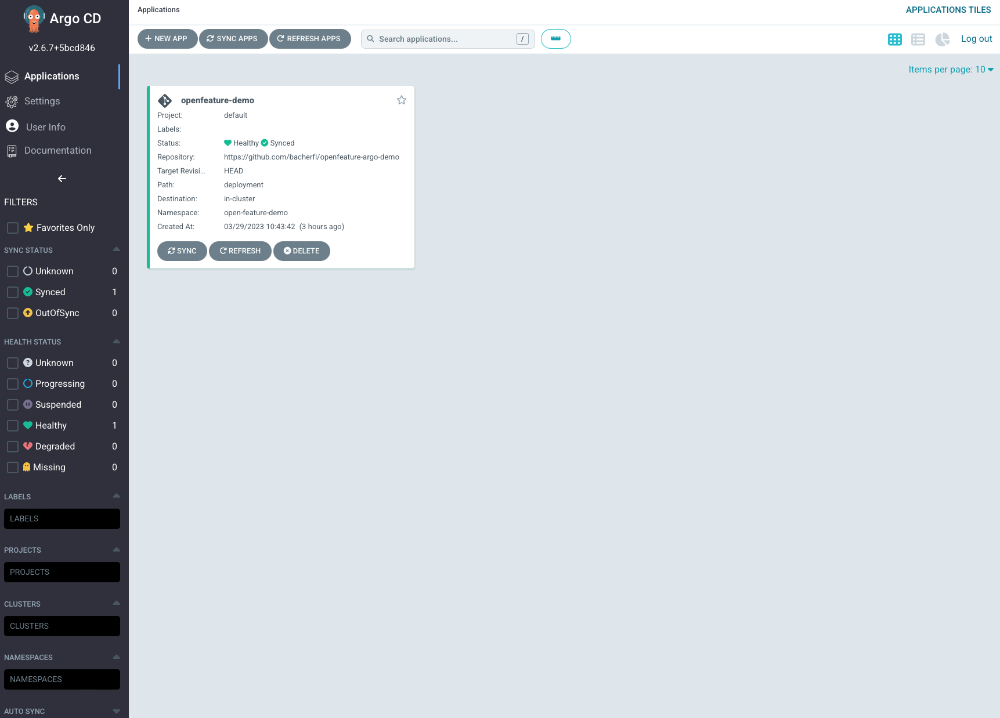
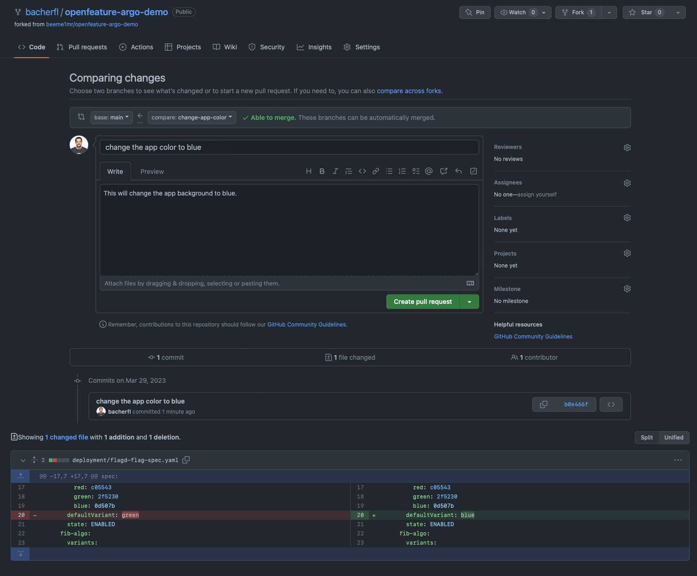
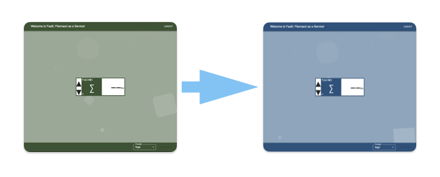
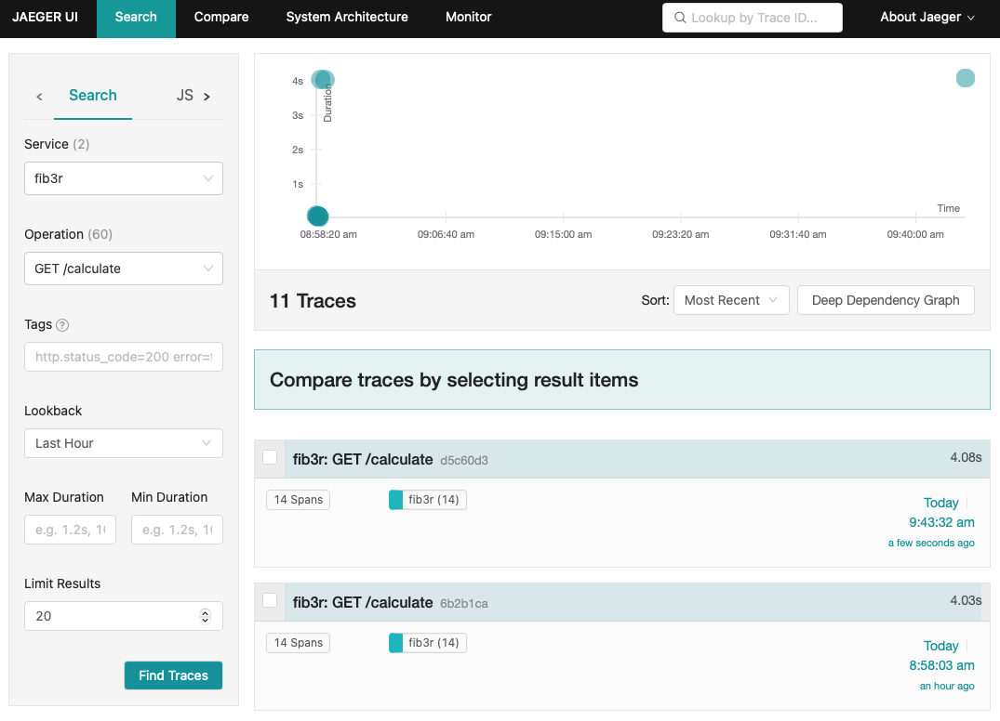
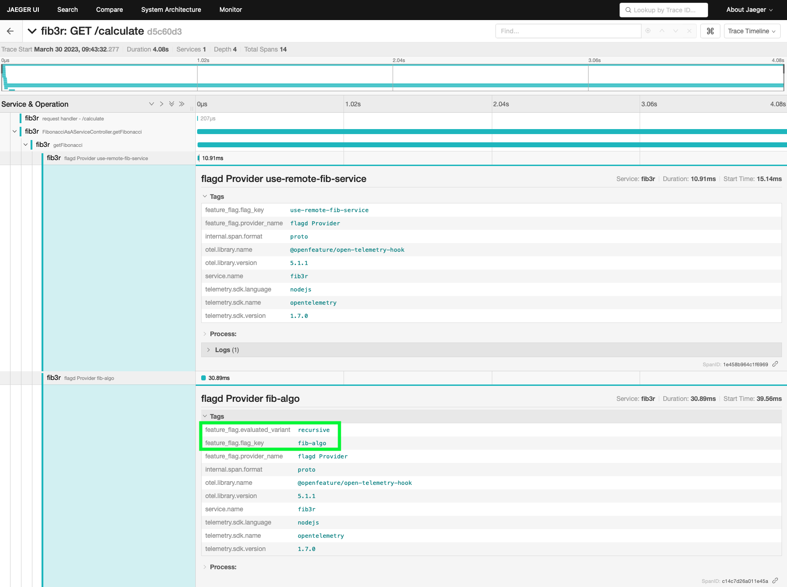
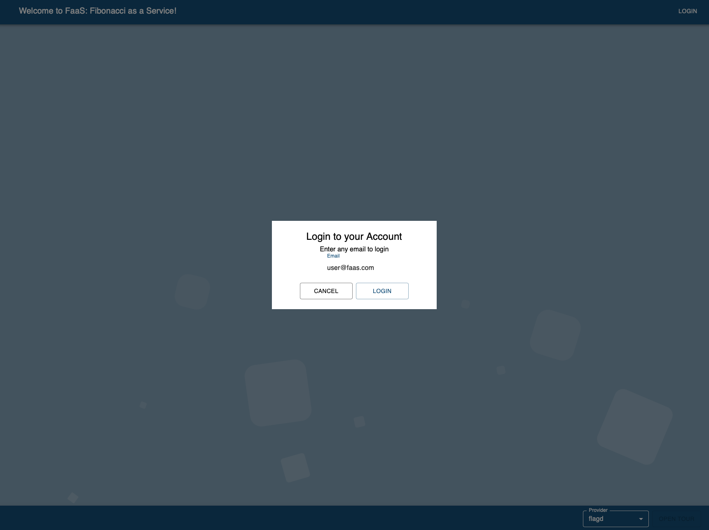
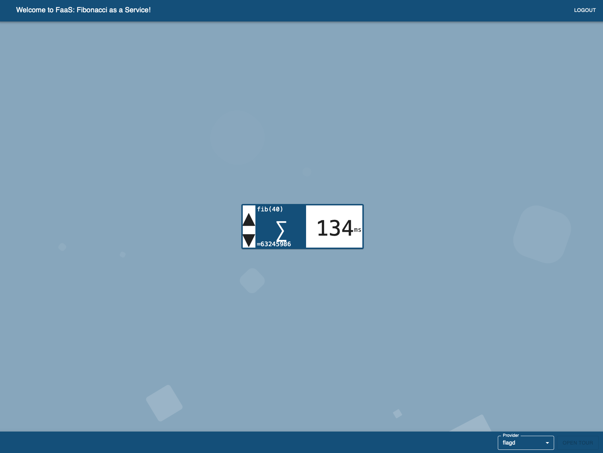
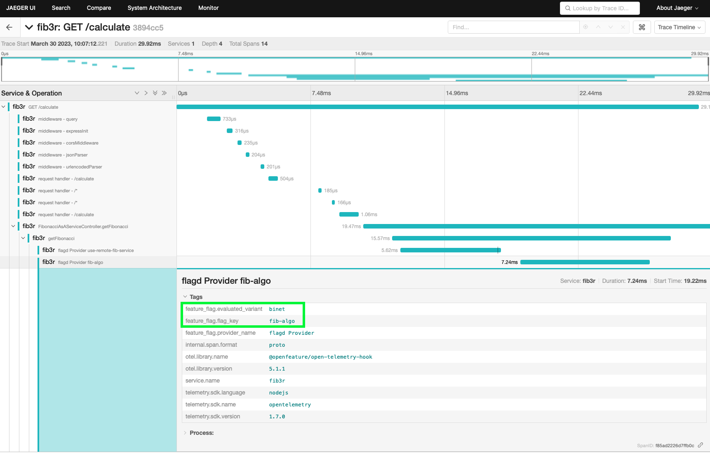

# OpenFeature ArgoCD Demo

This demo showcases how the OpenFeature Operator allows to integrate with ArgoCD to control feature flags 
in a GitOps environment. Using the `FeatureFlagConfiguration` CRD which lives in the application's GitOps 
reppository, features can be enabled/disabled by creating a pull request for the GitOps repository. Once a PR has been merged,
ArgoCD will pick up that change and automatically apply the updated configuration. 
Changes for a feature flag will be immediately reflected in the demo application, without the need to restart the pod running the application.
This is enabled by a Grpc event stream between the application and the flagd instance injected by the OpenFeature Operator. This event stream will
notify the application about any changes that have been made to a feature flag.

*Note:* Until https://github.com/open-feature/open-feature-operator/issues/371 has been implemented in the OpenFeature Operator, the  event stream based
client-side feature flagging is enabled by an nginx container within the pod running the application. This container can be accessed via a `flagd-service` Kubernetes service
and will proxy all flagd requests to the flagd container injected by the OpenFeature Operator.

## Setting up the Demo

To setup the demo, you must be connected to a K8s cluster (this demo has been tested on Kubernetes version `v1.25.6`).
To install everything, use the following command:

```shell
make install-environment GITOPS_REPO="<gitops repo url>"
```

This will install everything you need to deploy the demo application. The installed components are:

1. *Cert-manager:* Required by the OpenFeature Operator
1. *OpenFeature Operator*: Will inject the flagd sidecar into the application's pod
1. *ArgoCD:* Will watch the GitOps repository and apply any changes once they have been merged into the main branch

In addition to deploying these three components, an ArgoCD `Application` will be created. This will ensure that ArgoCD is 
watching the GitOps repo you specify using the `GITOPS_REPO` parameter for the `make install-environment` command.

You can afterwards also login to ArgoCD to check if the Application has been created and view its sync status:

1. Create a port-forward to the `argocd-server`. This can be done using: 

```shell
make port-forward-argo
```

Running this command will make ArgoCD accessibla via [http://localhost:8081](http://localhost:8081). When accessing ArgoCD, you will be prompted to enter your credentials.
Those are auto generated when ArgoCD is installed, and can be retrieved using the `argocd` CLI, using the following command:

```
argocd admin initial-password -n argocd
```

This will give you the login password for ArgoCD. The user name is `admin`.

Once logged in to the ArgoCD UI, you should see the `openfeature-demo` application:



This application will be automatically synced every 30 seconds, so you should also see the deployment of the sample application, as well as a `Jaeger` instance in the `open-feature-demo` namespace. 

```shell
$ kubectl get all -n open-feature-demo

NAME                                                           READY   STATUS    RESTARTS   AGE
pod/open-feature-demo-go-feature-flag-proxy-5f969dbd4c-9k6rk   1/1     Running   0          3h22m
pod/open-feature-demo-jaeger-agent-75b58df947-n4n85            1/1     Running   0          3h22m
pod/open-feature-demo-playground-app-65449d5444-q8vph          3/3     Running   0          153m
pod/open-feature-fib-service-6c7b76d997-zk2z5                  2/2     Running   0          3h22m

NAME                                       TYPE        CLUSTER-IP       EXTERNAL-IP   PORT(S)     AGE
service/flagd-service                      ClusterIP   192.168.62.139   <none>        8013/TCP    172m
service/open-feature-demo-goff-service     ClusterIP   192.168.49.26    <none>        1031/TCP    3h22m
service/open-feature-demo-jaeger-service   ClusterIP   192.168.58.66    <none>        6832/UDP    3h22m
service/open-feature-demo-jaeger-ui        ClusterIP   192.168.53.254   <none>        80/TCP      3h22m
service/open-feature-demo-service          ClusterIP   192.168.57.102   <none>        80/TCP      3h22m
service/open-feature-fibonacci-service     ClusterIP   192.168.61.80    <none>        30002/TCP   3h22m

NAME                                                      READY   UP-TO-DATE   AVAILABLE   AGE
deployment.apps/open-feature-demo-go-feature-flag-proxy   1/1     1            1           3h22m
deployment.apps/open-feature-demo-jaeger-agent            1/1     1            1           3h22m
deployment.apps/open-feature-demo-playground-app          1/1     1            1           3h22m
deployment.apps/open-feature-fib-service                  1/1     1            1           3h22m

NAME                                                                 DESIRED   CURRENT   READY   AGE
replicaset.apps/open-feature-demo-go-feature-flag-proxy-5f969dbd4c   1         1         1       3h22m
replicaset.apps/open-feature-demo-jaeger-agent-75b58df947            1         1         1       3h22m
replicaset.apps/open-feature-demo-playground-app-65449d5444          1         1         1       172m
replicaset.apps/open-feature-fib-service-6c7b76d997                  1         1         1       3h22m
```

To access the playground application, create a port-forward using the following command:

```shell
make port-forward-playground
```

This wil make the playground app accessible via [http://localhost:8085](http://localhost:8085).

## Changing a Feature Flag via PR

To demonstrate the change of a flag using a PR, adapt one of the flags in the file `deployment/flagd-flag-spec.yaml` and commit/push those changes to a 
branch of the GitOps repository, e.g.: 



Once the PR has been merged, the new background color should automatically be visible within ~30 seconds.



## Demonstrating Tracing Support

In addition to the playground application, the `open-feature-demo` namespace also contains a Jaeger instance, where the application sends traces to.
To demonstrate this, click on the element in the middle of the screen to start the calculation of the fibonacci number. Being logged out, the backend will
use the naive `recursive` algorithm to calculate the number, due to the configuration of the `fib-algo` feature flag. Due to this, the calculation will take a couple of seconds. 
To inspect the traces an Jaeger, use the following command to create a port-forward to the Jaeger UI:

```shell
make port-forward-jaeger
```

This will make the Jaeger UI accessible on [http://localhost:8082](http://localhost:8082). To inspect the traces of the `calculate` function in Jaeger, select the
`fib3r` service, and filter for the `GET /calculate` operation (see the screenshot below). This will give you a list of all traces related to this operation:



When selecting one, you will get to the detailed breakdown of the spans that are part of that trace. Here you will find the information that the flagd-provider evaluated
the `fib-algo` feature flag, which resolved to the `recursive` variant:



Now, to make things faster, we will go back to the app's UI and login with a user name that ends with `@faas.com`:



After you are logged in, trigger the calculation again - this time it will be much faster, due to the `binet` algorithm being used for logged in users:



Just like before, the trace for this operation can then again be inspected, only that this time the overall timespan will be much smaller, due to the different algorithm being chosen:



# Using other Flag Evaluation Tools

In addition to FlagD, the demo app supports the following feature provider tools:

- Environment Variable
- Go Feature Flag
- CloudBees Feature Management
- Split
- Harness
- LaunchDarkly
- Flagsmith